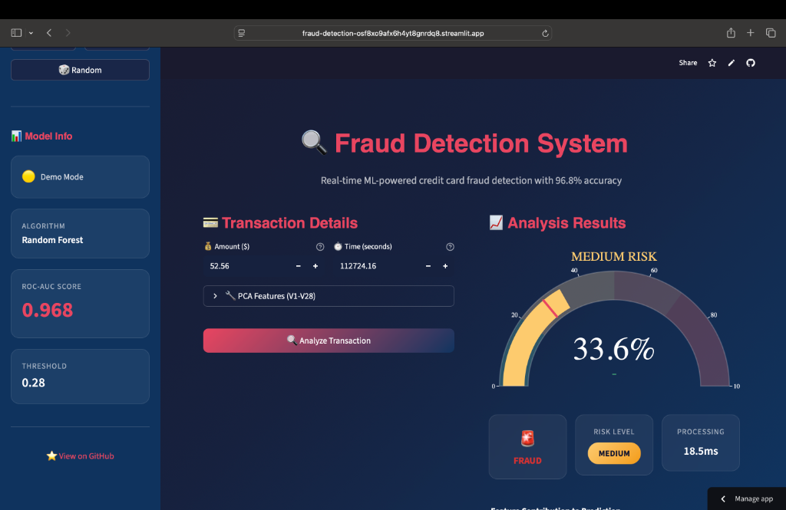
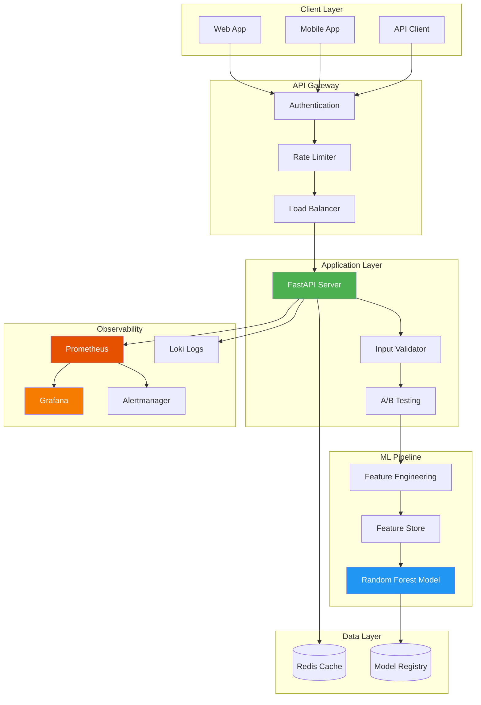

# Fraud Detection System

<div align="center">


**A production-grade machine learning system for real-time credit card fraud detection.**

[🚀 Live Demo](https://fraud-detection-osf8xo9afx6h4yt8gnrdq8.streamlit.app) • [Features](#-features) • [Quick Start](#-quick-start) • [API Docs](#-api-endpoints)

</div>

---

<div align="center">

<p><em>Interactive fraud detection dashboard with real-time predictions</em></p>
</div>

---

## 🏗️ Architecture



## 🎯 Live Demo

> **Interactive Demo**: [fraud-detection-osf8xo9afx6h4yt8gnrdq8.streamlit.app](https://fraud-detection-osf8xo9afx6h4yt8gnrdq8.streamlit.app) *(Free hosted demo)*
>
> **API Endpoint**: `https://fraud-detection.up.railway.app` *(Deploy your own - see below)*

### Try the Streamlit Demo Locally

```bash
# Clone and run
git clone https://github.com/imranow/fraud-detection.git
cd fraud-detection
pip install -r requirements.txt
streamlit run streamlit_app.py
```

### API Example

```bash
curl -X POST https://your-app.up.railway.app/predict \
  -H "Content-Type: application/json" \
  -d '{"Time": 0, "V1": -1.36, "V2": -0.07, "V3": 2.54, "V4": 1.38, "V5": -0.34, "V6": 0.46, "V7": 0.24, "V8": 0.10, "V9": 0.36, "V10": 0.09, "V11": -0.55, "V12": -0.62, "V13": -0.99, "V14": -0.31, "V15": 1.47, "V16": -0.47, "V17": 0.21, "V18": 0.03, "V19": 0.40, "V20": 0.25, "V21": -0.02, "V22": 0.28, "V23": -0.11, "V24": 0.07, "V25": 0.13, "V26": -0.19, "V27": 0.13, "V28": -0.02, "Amount": 149.62}'
```

## 🚀 Features

| Category | Features |
|----------|----------|
| **ML/AI** | Random Forest classifier, 48 engineered features, 0.968 ROC-AUC |
| **API** | FastAPI, async, batch predictions, custom thresholds |
| **Security** | API key auth, rate limiting, input validation |
| **MLOps** | MLflow tracking, DVC data versioning, automated retraining |
| **Monitoring** | Prometheus metrics, Grafana dashboards, Loki logs |
| **Infrastructure** | Docker, Kubernetes, CI/CD, HPA autoscaling |
| **Testing** | pytest, Locust load tests, 90%+ coverage |

## 📊 Model Performance

| Metric | Value | Description |
|--------|-------|-------------|
| **ROC-AUC** | 0.968 | Excellent discrimination |
| **Recall** | 87.8% | Catches most fraud |
| **Precision** | 65.6% | Low false positives |
| **F2 Score** | 0.822 | Recall-weighted |
| **Latency** | <50ms | P99 response time |

## 📥 Getting the Data

The dataset is the [Kaggle Credit Card Fraud Detection](https://www.kaggle.com/datasets/mlg-ulb/creditcardfraud) dataset (144MB). It's not included due to size limits.

```bash
# Option 1: Download script (recommended)
python scripts/download_data.py

# Option 2: Manual - download from Kaggle, place in data/raw/

# Option 3: DVC (for teams with remote storage configured)
dvc pull
```

## 📁 Project Structure

```
fraud-detection/
├── src/fraud_detection/
│   ├── api/              # FastAPI + auth + rate limiting
│   ├── data/             # Data loading & preprocessing
│   ├── features/         # Feature engineering + store
│   ├── models/           # Model trainers
│   ├── evaluation/       # Metrics & evaluation
│   └── utils/            # MLflow config, logging
├── k8s/                  # Kubernetes manifests
├── prometheus/           # Alerting rules
├── grafana/              # Dashboards
├── tests/                # Unit + load tests
└── scripts/              # Training, deployment
```

## 🛠️ Quick Start

### Docker (Recommended)

```bash
# Clone
git clone https://github.com/imranow/fraud-detection.git
cd fraud-detection

# Download data
python scripts/download_data.py

# Run with monitoring
docker-compose --profile monitoring up -d

# Test
curl http://localhost:8000/health
```

### Local Development

```bash
python -m venv .venv && source .venv/bin/activate
pip install -r requirements.txt
python scripts/download_data.py
PYTHONPATH=src uvicorn fraud_detection.api.main:app --reload
```

## 🔐 API Authentication

```bash
# Generate API key
source .venv/bin/activate
PYTHONPATH=src python -c "from fraud_detection.api.auth import generate_api_key; print(generate_api_key())"

# Use in requests
curl -H "X-API-Key: your-key" http://localhost:8000/predict ...
```

## 📡 API Endpoints

| Endpoint | Method | Description |
|----------|--------|-------------|
| `GET /health` | Health check |
| `POST /predict` | Single prediction |
| `POST /predict/batch` | Batch predictions (up to 1000) |
| `GET /model/info` | Model metadata |
| `GET /metrics` | Prometheus metrics |
| `GET /docs` | Swagger UI |

### Example Response

```json
{
  "is_fraud": false,
  "fraud_probability": 0.0049,
  "risk_level": "LOW",
  "threshold_used": 0.28,
  "processing_time_ms": 12.5
}
```

## 📈 Monitoring Dashboard

Access after running `docker-compose --profile monitoring up -d`:

| Service | URL | Credentials |
|---------|-----|-------------|
| **API Docs** | http://localhost:8000/docs | - |
| **Prometheus** | http://localhost:9090 | - |
| **Grafana** | http://localhost:3000 | admin/admin |

## ☸️ Kubernetes Deployment

```bash
# Deploy all components
./scripts/k8s-deploy.sh deploy

# Or with kubectl
kubectl apply -k k8s/

# Port forward
./scripts/k8s-deploy.sh forward
```

## 🚀 Deploy to Cloud

### Streamlit Cloud (Interactive Demo)

Deploy the interactive Streamlit demo for free:

1. Fork this repo to your GitHub account
2. Go to [share.streamlit.io](https://share.streamlit.io)
3. Connect your GitHub and select this repo
4. Set main file path to `streamlit_app.py`
5. Click Deploy!

### Railway (API)

[](https://railway.app/template/fraud-detection)

```bash
# Or via CLI
railway login
railway init
railway up
```

### Google Cloud Run

```bash
gcloud run deploy fraud-detection \
  --source . \
  --region us-central1 \
  --allow-unauthenticated
```

## 🔥 Load Testing

```bash
pip install locust
locust -f tests/load/locustfile.py --host=http://localhost:8000
```

## 🧪 Testing

```bash
# Unit tests
pytest tests/ -v --cov=fraud_detection

# Load tests
locust -f tests/load/locustfile.py --headless -u 50 -r 10 -t 60s
```

## 📝 License

MIT License - feel free to use for your own projects!

---

<div align="center">

**Built with ❤️ by [Imran](https://github.com/imranow)**

</div>
